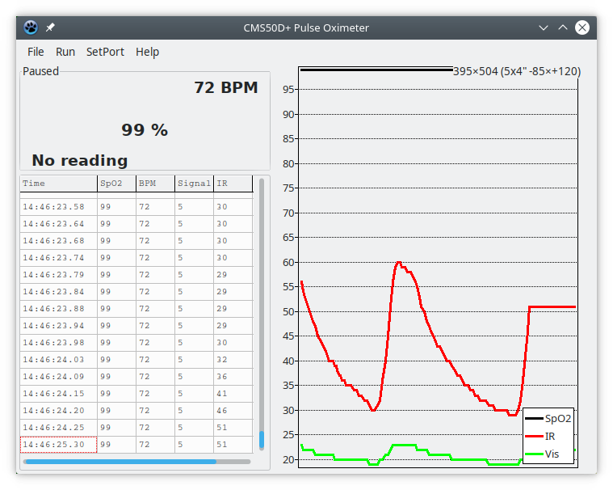

This is a fairly simple program which receives the data stream from a Contec CMS50D+ pulse oximeter (v4.6 firmware only) and outputs it to either the console or to a GUI as a sequence of decoded values. The data flow is determined by the instrument, but there will typically be 60 readings per second running for 30 seconds.

This tries- usually successfully- to work out which USB/serial port is connected to the meter. Because this uses a lot of OS-specific stuff it is not anticipated that it will be easily portable to anything except Linux, but the remainder of the program should be more tolerant. If the port can't be determined automagically, then it must be specified explicitly (on the command line as the final parameter, or using the GUI menu).

The console output is basically a timestamped line showing the meter's current range and value. Alternatively, the -F or --format parameter can take a printf-style string, in which case the value (and only the value) is output formatted as specified. If the -F parameter is @, then raw hex-formatted packets are output.

In a more general case, use %x@yBzd or %x@yLzd to go to offset x in the received message extract and y bytes of big/little-endian data with C-style format %zd etc. There's lots more possibilities to allow the reading to be scaled and offset using postfix (RPN) operations, please refer to the source for details.

The console-only variant of the program may be compiled using the included makefile. The GUI variant, which can also run as a console program, may be compiled using the included Lazarus project (.lpi) file. Any references to the Lazarus source files are cosmetic, and may be excised (see inifilesabout.pas) without affecting core functionality.

The GUI variant of the program has menu entries for logging data values as they arrive and dumping accumulated data (around 1000 lines of text are saved internally and around 100 graphical points). The code to implement these facilities has not yet been done, in part because I've not worked out what formats I want.

